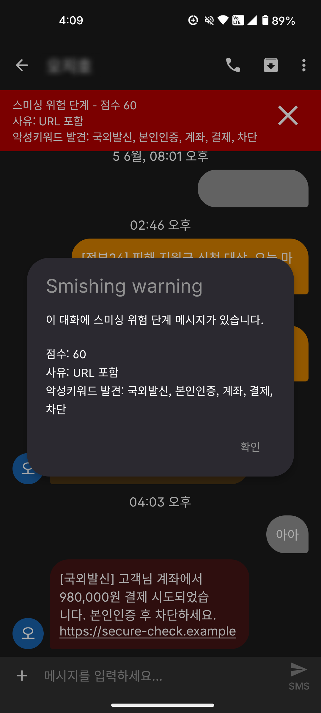

# Fossify Messages 스미싱 탐지 기능 구현 상태 정리



## 1. 목표

Fossify Messages 오픈소스 앱에 스미싱 탐지 기능을 추가했다.  
문자 본문을 점수화해 안전, 의심, 경고, 위험 단계로 분류하고, 위험도가 있는 문자는 목록과 대화 내부에서 시각적으로 경고하도록 구현했다.

## 2. 현재 점수 체계

| 단계 | 점수 범위 | 표시 색상 |
|---|---:|---|
| 안전 | 0-9점 | 별도 표시 없음 |
| 의심 | 10-19점 | 노랑 `#d98200` |
| 경고 | 20-39점 | 주황 `#c16605` |
| 위험 | 40점 이상 | 빨강 `#b50000` |

초기에는 안전 단계에 연두색을 쓰는 방안이 있었지만, 현재는 안전 색상 표시를 제거했다.

## 3. 탐지 규칙

현재는 테스트용 MVP 규칙 기반 탐지로 구현했다.

- URL 포함 시 `+10점`
- 스미싱 의심 키워드가 발견될 때마다 `+10점`
- 키워드 예시:
  - 국외발신
  - 해외로그인
  - 본인인증
  - 인증번호
  - 계좌
  - 입금
  - 출금
  - 결제
  - 택배
  - 배송
  - 주소
  - 차단
  - 비밀번호
  - 상품권
  - 대출
  - 경찰청
  - 국세청
  - 법원
  - 검찰
  - 보안
  - 주민등록증

URL과 여러 악성 키워드가 함께 포함되면 한 번에 위험 단계까지 올라갈 수 있다.

## 4. 구현된 앱 동작

### 4.1 SMS 수신 시 탐지

`SmsReceiver`에서 SMS 본문을 조립한 직후 스미싱 점수를 계산한다.  
계산 결과는 `Message`와 `Conversation`에 저장한다.

저장 필드:

- `smishingScore`
- `smishingReasons`
- `smishingMessageId`

### 4.2 메인 대화 목록 표시

의심, 경고, 위험 단계의 대화는 메인 목록에서 배경색이 바뀐다.

- 의심: 노랑
- 경고: 주황
- 위험: 빨강

다크모드에서도 읽히도록 위험도 배경이 적용된 항목은 흰색 글자를 사용한다.

### 4.3 대화방 진입 경고창

의심 이상 메시지가 있는 대화방에 처음 들어가면 경고창이 표시된다.

- 확인 버튼은 5초 동안 비활성화
- 5초 후 확인 가능
- 한 번 확인한 메시지는 다시 경고창을 띄우지 않음

### 4.4 대화방 상단 배너

대화방 내부 상단에 스미싱 배너를 표시한다.

배너 내용:

- 단계: 의심, 경고, 위험
- 점수
- 사유
  - URL 포함
  - 악성키워드 발견

배너 오른쪽에는 `X` 버튼이 있으며, 누르면 현재 화면에서 배너를 닫을 수 있다.

## 5. 설정 기능

앱 설정 화면에 스미싱 탐지 전체 기능을 켜고 끄는 스위치를 추가했다.

설정 항목:

- `Enable smishing detection`

비활성화하면 탐지 표시, 목록 배경색, 진입 경고, 상단 배너가 동작하지 않는다.

## 6. 주요 수정 파일

탐지 로직:

- `app/src/main/kotlin/org/fossify/messages/helpers/SmishingDetector.kt`

수신 처리:

- `app/src/main/kotlin/org/fossify/messages/receivers/SmsReceiver.kt`

DB 모델:

- `app/src/main/kotlin/org/fossify/messages/models/Message.kt`
- `app/src/main/kotlin/org/fossify/messages/models/Conversation.kt`
- `app/src/main/kotlin/org/fossify/messages/databases/MessagesDatabase.kt`

대화 목록:

- `app/src/main/kotlin/org/fossify/messages/adapters/BaseConversationsAdapter.kt`

대화방 경고창 및 배너:

- `app/src/main/kotlin/org/fossify/messages/activities/ThreadActivity.kt`
- `app/src/main/res/layout/activity_thread.xml`

설정 화면:

- `app/src/main/kotlin/org/fossify/messages/activities/SettingsActivity.kt`
- `app/src/main/res/layout/activity_settings.xml`

색상/문자열/아이콘:

- `app/src/main/res/values/colors.xml`
- `app/src/main/res/values/strings.xml`
- `app/src/main/res/drawable/ic_close_vector.xml`

## 7. 빌드 및 설치 상태

Android SDK 설정:

- SDK 경로: `C:/Users/Massy_Ji/Documents/dualbluetooth/tools/android-sdk`
- 프로젝트 `local.properties`에 `sdk.dir` 설정 완료
- 설치한 SDK 패키지:
  - `platforms;android-36`
  - `build-tools;36.0.0`
  - `platform-tools`

APK 빌드:

- Gradle task: `:app:assembleCoreDebug`
- 빌드 성공
- APK 경로:
  - `Messages-opensource/Messages-main/app/build/outputs/apk/core/debug/messages-20-core-debug.apk`

ADB 설치:

- 연결 기기: `P31279005100`
- 설치 패키지: `org.fossify.messages.debug`
- 설치 성공

## 8. 위험 단계 테스트 문자 예시

```text
[국외발신] 고객님 계좌에서 980,000원 결제 시도되었습니다. 본인인증 후 차단하세요. https://secure-check.example
```

예상 점수:

- URL 포함: +10
- 국외발신: +10
- 계좌: +10
- 결제: +10
- 본인인증: +10
- 차단: +10

총점: `60점`  
예상 단계: `위험`

## 9. 다음 단계

현재는 MVP 규칙 기반 탐지다. 이후 고도화 방향은 다음과 같다.

- TF-IDF 기반 핵심 단어 추출 결과를 점수화에 반영
- 데이터셋 불균형 보정 후 모델 학습
- URL 리다이렉트 여부 검사
- 웹페이지 내용 분석
- 로컬 LLM 또는 경량 모델 기반 문맥 분석
- 코사인 유사도 기반 탐지는 데이터 보강 후 재검토
